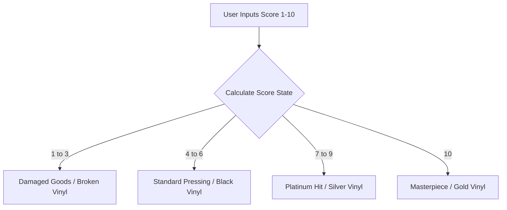
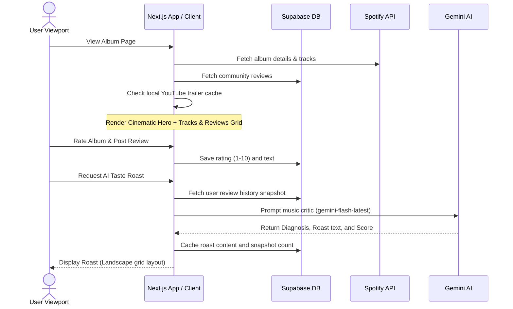

# Spinyl: UI/UX Case Study

A high-fidelity social music cataloging application that transforms how music lovers rate, review, discover, and share their vinyl collections and album reviews, integrated with Spotify and powered by generative AI.

---

## Executive Summary

**Spinyl** is designed for audiophiles and casual listeners who want a tactile, visual, and social way to review albums. In a world dominated by generic star ratings and flat lists, Spinyl returns to the physical roots of music appreciation. It reimagines album scoring through an **interactive vinyl record rating system**, creates immersive album environments with **cinematic backdrop trailer searches**, integrates gamified **AI taste roasts**, and compiles user verdicts into **custom social sharing cards**. 

The application utilizes a dark, premium aesthetic built on **Material 3 Expressive Design** principles, ensuring responsive visual layout systems across mobile, tablet, and desktop viewports.

---

## 1. The Design System (Material 3 Dark)

Spinyl’s design system is built to evoke the feeling of a dimly lit, high-end listening room or an ambient record store. It uses vanilla CSS tokens mapped to Material 3 tokens:

### Color Palette
- **Primary / Core Canvas:** Pure OLED Black (`#000000`) and Deep Surface Black (`#0a0a0a`) provide a high-contrast backdrop that allows colorful album covers to pop.
- **Accents:** Warm orange, golden-amber, and deep copper tones (`#ff9f68`, `#ffa776`, `#daa520`) are used to represent glowing tube-amplifiers and spinning vinyl brass weights.
- **System States:** High-visibility alerts (`#ffb4ab` for error, `#E50914` for the special Netflix theme, and green `#1DB954` for Spotify connectivity cues).

### Typography
- **Display Typography:** Serifs (Georgia, Times New Roman) with aggressive line-heights and italics are used for album names, giving the app a journalistic, music-critic feel.
- **Body & Controls:** Noto Sans and Inter are used for structural texts, settings, and interactive elements for ultimate readability.

### Tactility and Physics
- **Spring Physics:** Custom transition values simulate physical drag and inertia:
  ```css
  --transition: all 0.4s cubic-bezier(0.34, 1.56, 0.64, 1);
  --transition-spring: all 0.5s cubic-bezier(0.175, 0.885, 0.32, 1.275);
  ```
- **Glassmorphism:** Tactile "glass-tuner" panels (`.glass-panel-m3`) use high-level backdrop filters (`backdrop-filter: blur(24px) saturate(180%)`) to create layered container depths over a dynamic ambient background gradient.

---

## 2. Immersive Visual Components

### A. The Tactile Vinyl Rating System (`VinylRatingInput.tsx`)
Rather than relying on generic star controls, Spinyl introduces a custom 1-10 vinyl record slider. The vinyl disc shifts state visually based on the user's verdict:



- **Visual States:**
  - **Gold (`score == 10`):** Features custom gold radial gradients, rotating sparkles, and gold outlines.
  - **Silver (`score >= 7`):** Uses coppery-silver radial reflections.
  - **Black (`score >= 4`):** Displays a classic dark vinyl face with a subtle orange glow deep inside the grooves.
  - **Broken (`score <= 3`):** Applies SVG path cracks, blurring the central record label and altering the center ratings color.
- **Tactile Feedback:** Dragging the slider dynamically rotates the vinyl disc (`value * 36` degrees) with spring inertia, linking hand motion directly to the visual output.

---

### B. Cinematic Album Backdrops (`CinematicHero.tsx`)
To make each album detail page feel like a distinct experience, Spinyl creates an immersive hero area:

1. **Automated Search:** On the server, a search is dispatched to YouTube for `"${albumName} ${artistNames} official trailer"`.
2. **Asset Caching:** The resulting YouTube Video ID is saved locally (`app/album/cache/`) to eliminate layout shifts or third-party query latency on subsequent page visits.
3. **Immersive Backdrop:** The hero utilizes the high-resolution YouTube video thumbnail as a background, enhanced with physical brightness and contrast filters, covered by a linear gradient fade that merges the video container directly into the OLED background.
4. **Interactive Playback:** Hovering over the cinematic banner reveals a clean, overlay play button that allows the user to open the trailer directly.

---

### C. Canvas-Baked Social Sharing Card (`InstagramStoryCard.tsx`)
Music discovery is inherently social. Spinyl includes a custom feature to export reviews as **Instagram Stories (1080 x 1920 px)**.

- **The Challenge:** High-resolution CSS backdrop filters and blurs often fail or cause extreme lag when exported to canvas images using tools like `html2canvas`.
- **The UX Solution:** Spinyl bypasses performance-heavy styling by drawing a low-resolution canvas (`100x100`) of the album cover on the fly, applying a canvas-level filter blur (`ctx.filter = 'blur(4px)'`), baking a 40% dark overlay directly into the pixels, and converting it to a data URL (`canvas.toDataURL()`).
- **Layout & Visuals:**
  - Includes a noise overlay (via inline SVG fractal noise) to provide a premium paper grain feel.
  - Offsets the vinyl record relative to the sleeve (sliding out to the right) to make the record appear as though it is coming out of its sleeve.
  - Utilizes large, centered, serif typography to prioritize the user's review quote.

---

### D. Gamified AI Taste Roast (`RoastModal.tsx`)
To inject fun and encourage more reviews, Spinyl contains an AI Music Critic powered by Gemini:

1. **Trigger Condition:** Unlocked once a user has reviewed at least 3 albums.
2. **AI Analysis:** The backend compiles the last 50 reviews and ratings and prompts the Gemini Flash model to act as a brutally honest, aggressive, and hilarious music critic using simple English.
3. **Simulated Progress States:** A series of humorous status updates ("Scanning your questionable listening history...", "Consulting the Council of Cool...") keep the user entertained during the AI response latency.
4. **The Landscape Layout:** The modal shifts to a landscape split view on desktop (Left: Diagnosis and rating card; Right: Ruthless criticism text and "Share My Shame" export button).

---

## 3. Onboarding & Personalization (`ShelfWizard.tsx`)

Discovering new music and initializing a user's digital vinyl shelf is handled via a clean, 3-step wizard flow:

```
[ Step 1: Select Genres ] ──────> [ Step 2: Search Artists ] ──────> [ Step 3: View Recommendations ]
(Multi-select pills)             (Interactive search chips)          (Tactile vinyl covers grid)
```

- **Step 1 (Genre Selector):** Displays multi-select genre pills that light up with amber drop-shadows when clicked.
- **Step 2 (Artist Selector):** An autocomplete search bar that queries Spotify's API, letting users add up to 5 favorite artists (displayed as compact chips with ease-of-removal buttons).
- **Step 3 (Recommendations Grid):** Fetches personalized recommendation seeds based on the user's selected genres and artists, displaying them as interactive vinyl-sleeved cards that slide into view.
- **Persistence:** Saved immediately both in local storage and Supabase user profiles (`profiles.vibe`), ensuring an instant, non-loading return experience.

---

## 4. Key Micro-interactions & Mobile Optimizations

- **Spacebar Playback Interception:** Pressing the spacebar anywhere on the album page plays/pauses the Spotify player. The app monitors user focus (`document.activeElement`) to ensure standard typing behaviors in search bars, inputs, and textareas are not interrupted.
- **Tone-Arm Hover Hovering:** On desktop reviews, hovering over the record jacket pauses the vinyl spinning animation and rotates the SVG tone-arm from a relaxed position (32 degrees) to an active groove position (15 degrees) with spring physics.
- **Mobile Adaptive Layouts:**
  - On desktop, tracks and reviews are placed in side-by-side grids.
  - On mobile, they collapse into a single column with an Android-style sticky tab bar (`m3-tab-bar`) with custom indicators, reducing vertical scrolling clutter.
  - Review writing forms slide up as a bottom sheet with a central handle bar.

---

## 5. Technology Stack & Data Architecture



---

## Conclusion & Future Evolutions

Spinyl’s UX successfully bridges the gap between digital convenience and physical nostalgia. By replacing conventional stars with interactive, state-changing vinyl models, injecting humor through AI roasts, and creating highly shareable social graphics, the app elevates music logging from a utility to a delightful hobby. 

Future visual expansions could include custom themes based on the dominant color of the current album's artwork (dynamic vibrancy extraction) and real-time multiplayer listening rooms.
